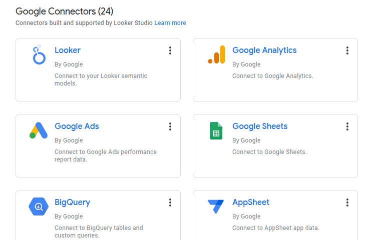

I’ll start this post with a confession. It has been four months since I built the dashboard for [The Impostors League](/project/pes_tournament/) project. Spoiler alert: I haven’t opened Looker Studio since then. My memory is fuzzy, but hey—that makes this post more fun to write. Think of it as a reflection, with extra sprinkles of chaos.

# What is Looker Studio?
Looker Studio is Google’s free, web-based data viz tool. Think of it as the chill, younger sibling of Power BI or Tableau... the one that doesn’t ask you to install anything or set up a whole environment.

It’s part of the Google Workspace ecosystem, so if you’re already living in Sheets and Docs (guilty), it fits right in.

## Importing Data
Getting your data in is easy, especially from Google Sheets. You just hit `ADD DATA`, point to your spreadsheet, and boom... you’re in.

Besides Sheets, it can also pull from BigQuery, Google Analytics, Excel, MySQL, Looker, and some other fancy sources I didn’t touch (because dorm Wi-Fi is a thing).

## Adding Charts
Building the charts? Honestly, kind of fun. You grab a table, drag it onto your canvas, customize a few fields, then pick out the pie chart. 

If you’ve ever touched Tableau or Power BI, Looker Studio will feel familiar. I watched one YouTube video (linked below) and that was all I needed:

<iframe width="100%" height="400" src="https://www.youtube.com/embed/Coe_f79Xc2o"
title="YouTube video player" frameborder="0"
allow="accelerometer; autoplay; clipboard-write; encrypted-media; gyroscope; picture-in-picture; web-share"
allowfullscreen></iframe>

# My Experience
It took me around four hours to build three dashboards for our PES tournament.

One dashboard showed tables and results. Another tracked attacking stats. And the third? Defensive resilience... we all needed proof that Philimon wasn’t actually “unlucky,” just bad at defense. 😄

The process itself felt smooth. I could open Looker Studio in my browser, drag things around, and—most importantly—share it with my friends via link. No logins, no app installs, no “wait, how do I open this file?”

But not everything was sunshine. Some calculations had to be done in Google Sheets first because Looker Studio’s formulas are... let's just say *humble*. And a couple of charts acted moody—they’d vanish until I refreshed the page like five times.

That said, the whole thing was fun. I wasn’t stressing about perfect layouts or advanced filters. I was just telling a story with data, and Looker Studio made that surprisingly easy.

## Pros
- **No Setup Drama**: Just open it in your browser and start.
- **Beginner-Friendly**: I didn’t feel like I needed a PhD to get things moving.
- **Seamless with Google Sheets**: I had already planned to collect the data in Sheets, so this was perfect.
- **Instant Sharing**: Sharing a link was enough for my friends to jump in.
- **Live Updates**: Edits in Sheets reflected instantly on the dashboard (after you manually told it to update).
- **It’s Free**: Can’t beat free, especially on a student budget.

## Cons
- **Limited Customization**: Want custom fonts, layouts, or fancy animations? Nope.
- **Chart Selection is Basic**: You get the essentials—bar, pie, table—but nothing spicy like violin plots.
- **Buggy on Slow Wi-Fi**: Sometimes charts didn't show up unless we refreshed the page.
- **Math is Better in Sheets**: For anything slightly complex, I had to go back to Google Sheets.
- **Mobile View is Mid**: On phones, scrolling was weird and layouts broke like LEGO bricks.

# Lessons Learned
- Start with a clean sheet (pun intended)—good headers, no merged cells, no chaos.
- Do your heavy lifting (a.k.a. simple feature engineering) in Google Sheets first.
- Keep things simple. This isn’t Tableau, and that’s fine.

# Will I Use Looker Studio Again?
Mostly, no.

Why did I feel like that was harsh?

Maybe... if the situation is casual and I need something quick and collaborative.

But if I’m presenting in class, applying for internships, or trying to impress someone with fancy slicers—Power BI or Tableau are still the go-tos.

Still, I’d totally recommend Looker Studio to any student, beginner, or anyone who wants to dip their toes into data viz without drowning.

### Resources I Found Useful
- [Looker Studio Documentation](https://support.google.com/looker-studio)
- [Community Visualizations Gallery](https://lookerstudio.google.com/gallery)

If you want to see how we used the dashboard during our PES tournament, check out [The Impostors League](/project/pes_tournament/) project.

Tried Looker Studio? Have strong opinions on pie charts? Drop them in the comments below—I’d love to hear your hot takes. 🍕📊
