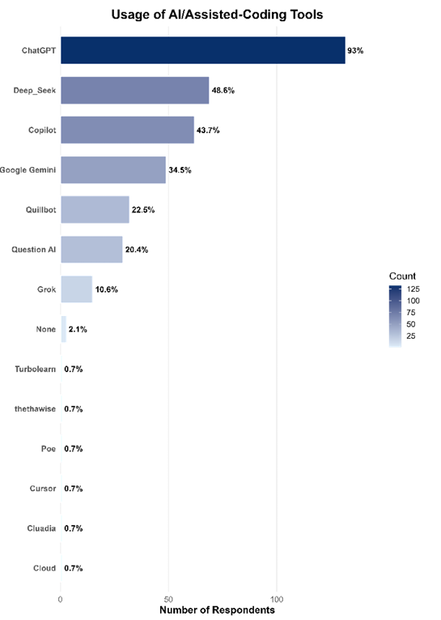
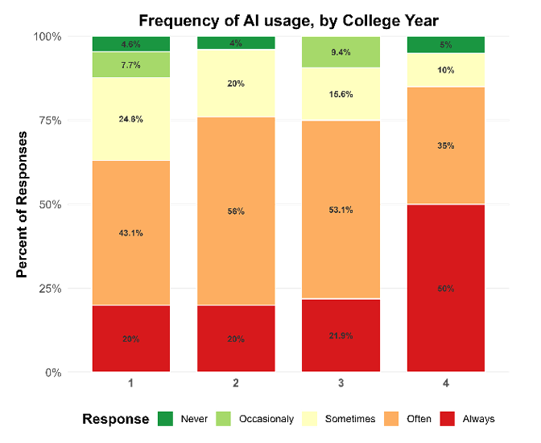
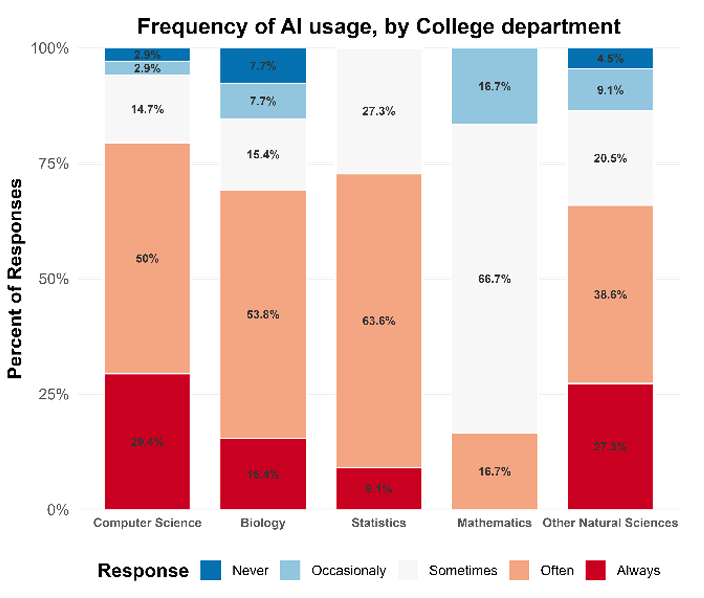
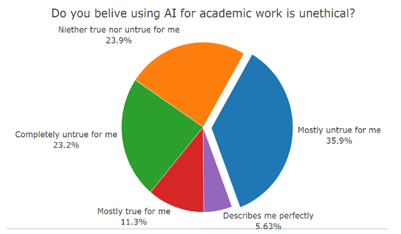

**Heads‑up:** All the plots below were generated from our survey data analysis using R. For more detail, check out this [separate blog post](/blog/r_ai_survey).

## 🎬 How It All Started  

We're a group of Statistics students who got curious: **how much do our classmates really lean on AI tools like ChatGPT?** We used this idea as a spring board for our end of year research project.
We built a survey, crunched some numbers, and wrote up the results. The data are eye‑opening, the trends are interestingl, and (as we'll happily admit) the sampling isn't perfect.

---

## 🧪 Our Not‑So‑Perfect Method  

- **Target population:** undergrads in four College of Natural Sciences, Addis Ababa University departments (CompSci, Biology, Statistics, Math).  
- **Intended sampling:** Two stage sampling... Probability Proportional to Size sampling to select the departments first, and then stratified by department and year as we thought there will be less variance in these strata.  
- **Reality check:** we couldn't get full student lists in time. We shared a Google Form in lectures and Telegram groups—so convenience bias crept in.  
- **Final N:** 142 usable responses.

---

## 🔥 What We Found  

| 🔍 Insight | 💭 Our Take |
|-----------|------------|
| **ChatGPT rules** (93% students used it last month). | It's free, fast, and always awake. |
| **AI = study buddy.** Assignments & revision top the usage list. | Goodbye textbooks, hello prompts. |
| **Seniority ⇒ more AI.** 4th‑years lead in heavy use. | Burn‑out or next‑level efficiency? You decide. |
| **Math majors resist.** Not one declared "always use AI." | Respect! |
| **Ethical worries? Meh.** 59% reject the "unethical" label. | AI already feels like standard kit. |

---

## 📊 Analysis & Plots  

### 1 • AI Tool Popularity  

*This bar chart shows just how dominant ChatGPT is compared with every other AI tool—we're talking almost absolute campus hegemony.*

---

### 2 • Usage Frequency by Year Level  

*You can see a slight trend here. Notice how the red and orange shades cluster on the right for Year 4—upper‑class students lean into AI far more heavily than first‑years do.*

---

### 3 • Department‑Wise Usage  

*Computer Science and Biology students show the highest proportions of "Often" and "Always" usage, while Mathematics remains the most skeptical.*

---

### 4 • Is Using AI Unethical?  

*More than half of respondents see nothing unethical about using AI for academic work—a sign that moral resistance is fading quickly.*

---

## ⚠️ Where We Slipped  

We'll own it: **our sampling wasn't fully random**. Distributing the survey in Telegram groups and classrooms likely attracted more AI‑keen, tech‑active respondents. Some departments (hello, Math) may be under‑ or over‑represented. That means **our numbers sketch an impressionistic mural, not a photorealistic portrait** of CNCS.

---

## 💡 Final Thoughts  

Even with the sampling caveat, the patterns are fascinating: AI tools are embedded in student life, ChatGPT is the clear favorite, and ethical qualms are fading fast. Next time, we'll grab a proper student roster, randomize within each stratum, and let confidence intervals sing.

Until then, enjoy this **partially correct** but wholly entertaining glimpse into campus AI culture—and feel free to replicate (or improve!) our study.

---

*Happy coding & good luck with your own surveys!* ✨

*If interested, you can find links to the raw data and the full report just below the title of this post!!*

*Special thanks to our advisor* **Mr. Yabebal** *Ayalew, whose insights were priceless in this project.*