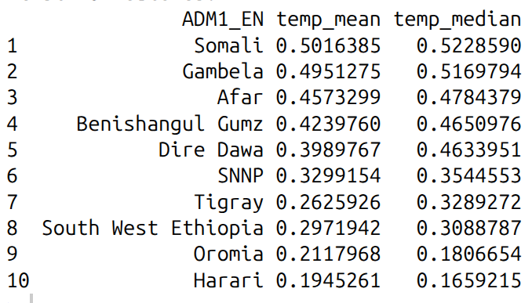
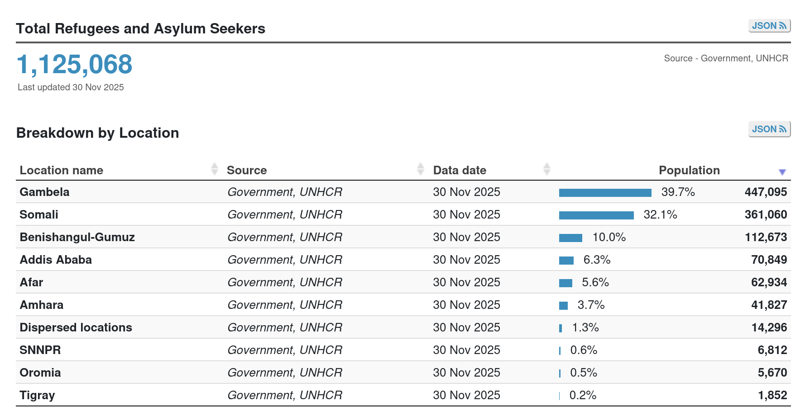
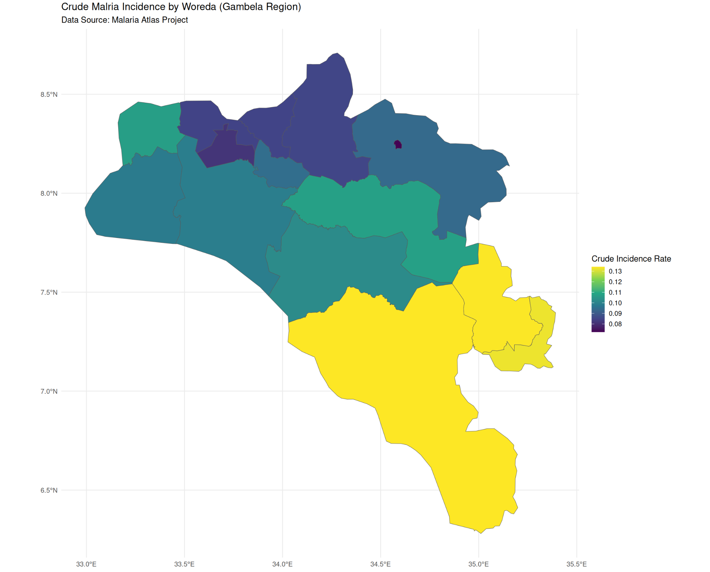
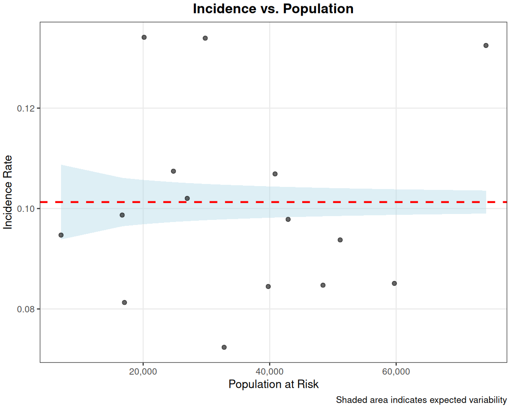
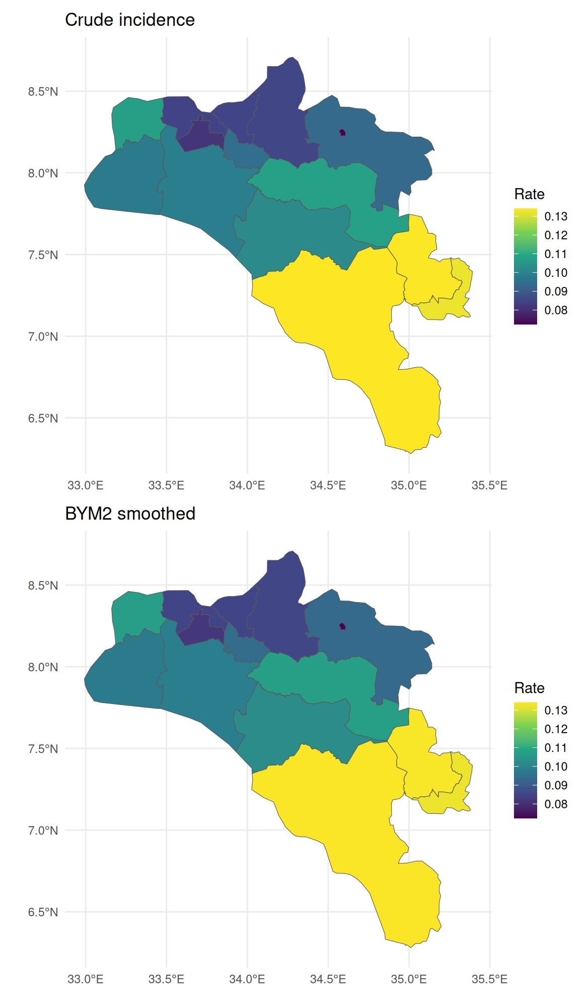
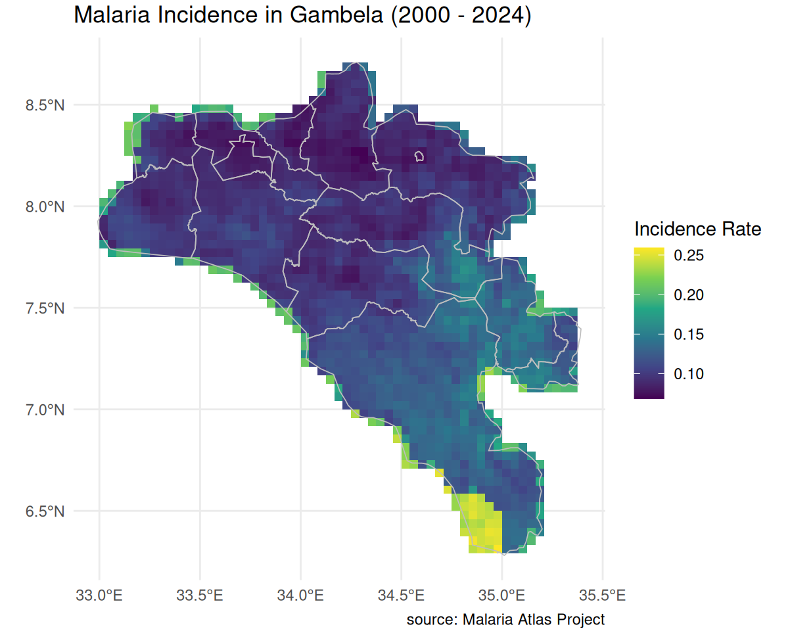

## Introduction and Background

Malaria remains a significant public health challenge in Ethiopia, with its transmission heavily influenced by environmental and geopolitical factors. For this project, we focused on the **Gambela region**, a unique area characterized by its low altitude, high temperature suitability for malaria, and complex geopolitical dynamics.

### Why Gambela?

1.  **Altitude**: Most of Gambela lies below 2,000 meters above sea level (masl), with floodplains below 500 masl. Epidemiologically, areas below 1,750m are of primary interest for malaria transmission.
2.  **Temperature Suitability**: Using data from the **Malaria Atlas Project**, we found that Gambela ranks as the second most suitable region in Ethiopia for *Plasmodium falciparum* transmission, following only the Somali region.

```r
# sorting region by mean temprature suitability
region |>
  select(c(ADM1_EN, temp_mean, temp_median)) |>
  arrange(desc(temp_mean))
```


*Ranking Ethiopia's regions according to temperature suitability for Plasmodium falciparum.*

3.  **Geopolitical Context**: As of November 2025, UNHCR puts 447,095 refugees and asylum seekers in Gambela, which is 39.7% of the total in Ethiopia. Proximity to conflicts in neighboring Sudan makes malaria transmission in this region a critical priority.


*Total refugees and asylum seekers in Ethiopia (Source: UNHCR Operational Data Portal).*

## Data and Methodology

We leveraged the `malariaAtlas` R library to extract spatial data. Our primary health indicator is the **Malaria Incidence Rate**, as it directly measures transmission risk, unlike mortality rates which often reflect healthcare access or behavior.

### Data Extraction Process

We extracted case counts, mortality rates, and population estimates using woreda-level geometries.

```r
# fetching malaria data through the malariaAtlas library
library(sf)
library(malariaAtlas)

# incidence rate per 1000 population from 2000 - 2024
incidence_id <- "Malaria__202508_Global_Pf_Incidence_Rate"

incidence_raster <- getRaster(
  dataset_id = incidence_id,
  shp = ethiopia,
  year = 2024
)

# only taking the mean estimates for the rates
incidence_raster <- incidence_raster[[1]]

# merging count and rate data with woreda shapes
gambela_malaria <- st_transform(gambela_woreda, crs(incidence_raster))
incidence_rate <- extract(incidence_raster, vect(gambela_malaria),
                          fun = mean, na.rm = TRUE)[, 2]
gambela_malaria$incidence <- incidence_rate
```

## Crude Rate Analysis

Our initial step was to map the crude incidence rates. The choropleth map below shows a clear trend: the risk of malaria increases significantly as we move from the North-East toward the Southern woredas.

```r
# choropleth (crude rates)
library(ggplot2)

ggplot(gambela_malaria) +
  geom_sf(aes(fill=incidence)) +
  scale_fill_viridis_c(option = "viridis", name = "Crude Incidence Rate") +
  labs(
    title = "Crude Malria Incidence by Woreda (Gambela Region)",
    subtitle = "Data Source: Malaria Atlas Project",
  )+
  theme_minimal()
```


*Map showing crude malaria incidence rates across Gambela woredas.*

### Analysis of Small Population Effects

In disease mapping, small population denominators can lead to unstable rate estimates. To check this, we plotted the crude incidence rate against population size with **variability bands (funnel plot)**.

```r
# calculating variability bands at 95% confidence
overall_rate <- sum(gambela_malaria$cases) / sum(gambela_malaria$pop)
gambela_malaria$incidence_se <- sqrt(overall_rate / gambela_malaria$pop)
gambela_malaria$incidence_lower <- overall_rate - 1.96 * gambela_malaria$incidence_se
gambela_malaria$incidence_upper <- overall_rate + 1.96 * gambela_malaria$incidence_se

# plotting population vs crude incidence rate
plot(
  x = gambela_malaria$pop, y = gambela_malaria$incidence,
  xlab = "Population ", ylab = "Crude Incidence Rate",
  main = "Crude Incidence Rate vs Population"
)
lines(gambela_malaria$pop, gambela_malaria$incidence_upper, col = "lightblue")
lines(gambela_malaria$pop, gambela_malaria$incidence_lower, col = "lightblue")
abline(h = overall_rate, col = "red")
```


*Funnel plot checking for small population effects on crude incidence rates.*

**Interpretation**: Most of our data points lie *outside* the funnel, even for small populations. Quantitatively, the ratio of expected variance to observed variance was only **0.0105**. This means only **1%** of the variability is explained by small denominators—the rest is likely due to spatial dependence or other overdispersion factors.

## Spatial Smoothing with BYM2

To distinguish between structured spatial patterns and random noise, we implemented the **Besag-Yor-Molie 2 (BYM2)** model using **INLA**.

```r
# implementing INLA and BYM2
library(INLA)
library(spdep)

gambela_malaria$ID <- 1:nrow(gambela_malaria)
nb <- poly2nb(gambela_malaria)
nb2INLA("gambela.graph", nb)

# Fitting BYM2 Model
bym2_model <- inla(round(cases) ~ 1 + f(ID, model = "bym2", graph = "gambela.graph"),
              family = "poisson", data = as.data.frame(gambela_malaria),
              E = expected, control.predictor = list(compute = TRUE, link = 1))

gambela_malaria$smoothed_incidence <- bym2_model$summary.fitted.values$mean * overall_rate

# crude and smoothed maps comparison
plot1 <- ggplot(gambela_malaria) + geom_sf(aes(fill = incidence)) +
  scale_fill_viridis_c(option = "viridis", limits = c(min_limit, max_limit)) +
  labs(title = "Crude incidence", fill = "Rate") + theme_minimal()

plot2 <- ggplot(gambela_malaria) + geom_sf(aes(fill = smoothed_incidence)) +
  scale_fill_viridis_c(option = "viridis", limits = c(min_limit, max_limit)) +
  labs(title = "BYM2 smoothed", fill = "Rate") + theme_minimal()

plot1 / plot2
```


*Comparison between crude incidence and BYM2 smoothed incidence.*

**Results**: Interestingly, the smoothing had a minimal effect. The percentage change between crude and smoothed rates ranged only from **-0.68% to 0.68%**. This suggests that the Malaria Atlas data might already be smoothed or imputed, and the strong spatial signal heavily outweighs random noise.

### Spatial Autocorrelation (Moran's I)

We ran a Global Moran's I test to confirm spatial dependence.

```r
# checking the presense of spatial signal
nb <- poly2nb(gambela_malaria, queen = TRUE)
lw <- nb2listw(nb, style = "W", zero.policy = TRUE)

moran_result <- moran.test(gambela_malaria$incidence, lw)
print(moran_result)
```

Both show strong positive spatial autocorrelation. The slight increase in Moran's I for the smoothed rate indicates that BYM2 successfully filtered out minor local noise.

| Sample Estimates | Crude Rate | Smoothed Rate |
| :--- | :--- | :--- |
| **Moran's I Statistic** | 0.58653260 | 0.59493873 |
| **Expectation** | -0.07142857 | -0.07142857 |
| **Variance** | 0.03449463 | 0.03447319 |
| **p-value** | 0.0001981 | 0.000166 |

*Table 4.1: Moran test value (crude incidence rate vs BYM2 incidence smoothed rate).*

## Modeling with Covariates: Accessibility

We investigated whether **travel time to the nearest healthcare facility** (Accessibility) explains malaria incidence.

```r
# fitting BYM2 model with INLA, offsetting by the population
model_bym2 <- inla(round_cases ~  accessibility + 
                     f(ID, model = "bym2", graph = "gambela.graph"), 
                   family = "poisson", data = gambela_malaria, E = pop,
                   control.predictor = list(compute = TRUE, link = 1),
                   control.compute = list(dic = TRUE, waic = TRUE))

summary(model_bym2)
```

| Variable | Non-Spatial (Poisson GLM) | BYM2 (Spatial Model) |
| :--- | :--- | :--- |
| **Intercept** | -2.490 (8.893e-03)*** | -2.451 (-2.572, -2.344) |
| **Accessibility** | 1.831 (6.901e-05)*** | 0.001 (0.000, 0.002) |
| **Precision** | - | 91.435 |
| **Phi** | - | 0.677 |
| **AIC / WAIC** | 1445.1 | 172.90 |

*Table 6.2: Comparison of Non-Spatial Poisson Log-Linear model vs spatial BYM2.*

**Key Finding**: In the non-spatial model, accessibility appeared significant. However, **this significance disappeared in the spatial model**. With a **Phi value of 0.68**, it became clear that location itself is a much stronger predictor than travel time.

## Sub-Woreda Insights

Aggregating data at the woreda level can sometimes hide local "hotspots." By looking at the raw raster data, we observed that the risk follows a **North-East to South-West** gradient.

```r
# cropping Ethiopia's incidence raster to Gambela only
library(terra)
library(tidyterra)

gambela_incidence <- crop(incidence_raster, vect(gambela_malaria), mask = TRUE)

ggplot() +
  geom_spatraster(data = gambela_incidence) +
  scale_fill_viridis_c(option = "viridis", na.value = "transparent", name = "Incidence Rate") +
  geom_spatvector(data = vect(gambela_malaria), fill = NA, color = "grey", linewidth = 0.3) +
  labs(title = "Malaria Incidence in Gambela (2000 - 2024)", caption = "source: Malaria Atlas Project") +
  theme_minimal()
```


*Raw raster-level malaria incidence in Gambela (Source: Malaria Atlas Project).*

## Public Health Implications

Based on our mapping and models, we recommend the following:

1.  **Prioritize Southern Woredas**: Dima, Mengesh, and Godere are the highest-risk woredas needing focus.
2.  **Strategic Refugee Placement**: Locate camps in the North-East where possible, as risk is lower.
3.  **Border Sensitivity**: Border areas show higher risk, likely due to migration and environmental factors. 
4.  **Beyond Woreda Borders**: Public health efforts should look at sub-woreda variations.

---

*This project was completed as part of an undergraduate study at the Department of Statistics, Addis Ababa University.*

## Acknowledgements

I would like to express my sincere gratitude to our instructor **Bedilu A. (PhD)** for his guidance and support throughout this project. 

Special thanks also go to my co-authors: **Remedan A. Musa**, **Yonas D. Melese**, **Hikma H. Eshetu**, **Hayat E. Shimels**, **Kibruyisfa E. Zebene**, **Arsema F. Tegafaw**, **Fitsum A. Zewude**, and **Michael T. Tadesse** for their hard work and contributions to this research.
