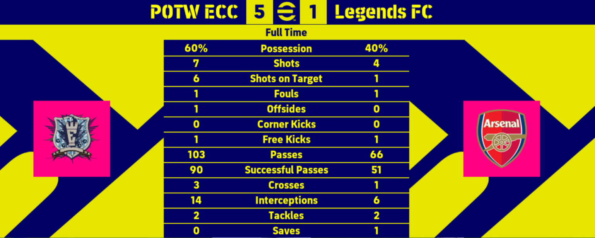
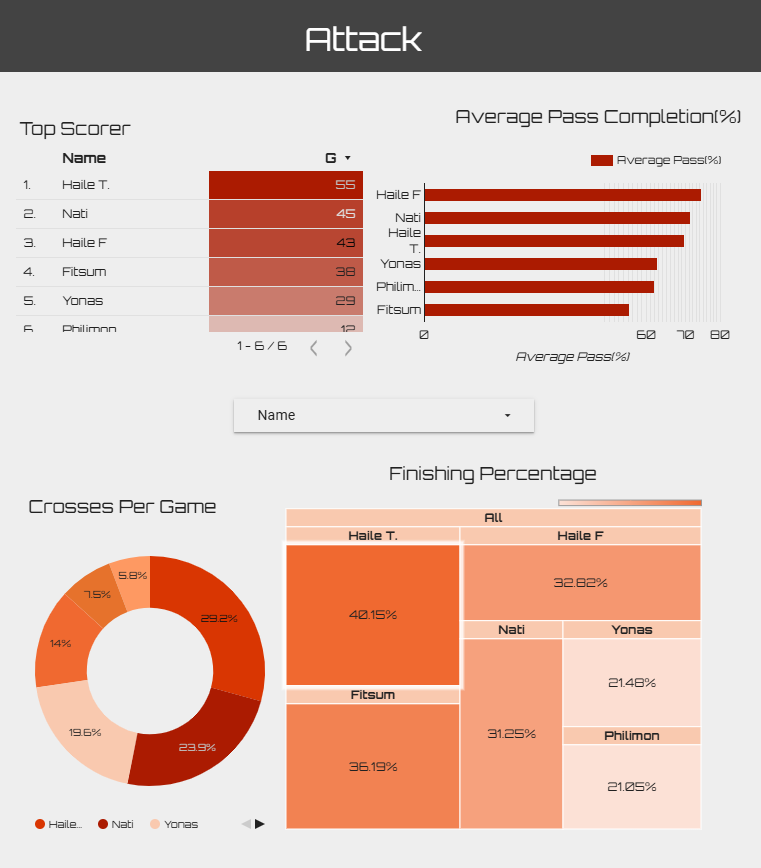
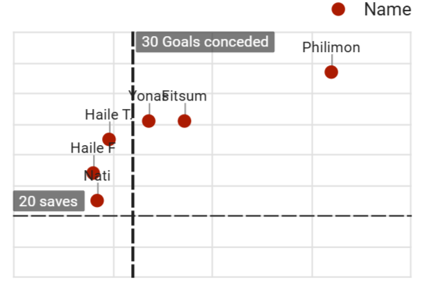

## 🎮 How It All Started

It began like many fun things do — with friends, games, and a bit of competitive energy. In our dorm, we were deep into football games, especially 2024-modded Pro Evolution Soccer 2017 (PES 17) matches, playing in a mini-league we called **The Impostors League**. (We refer to ourselves as *The Impostors* after another one of our favorite games, *Among Us*.) The banter was there, the competition was present, and then someone said: *"Wouldn’t it be cool if we started like a real league?"*

And just like that, the idea was born. A simple game night where we would rank ourselves in tables like a real league according to our 1-vs-1 match results. While my friends were talking about the rules and structures of the league, my mind was somewhere else already: The data. I knew we would need a way to store and visualize matchday data that goes beyond just match results.

## 🎯 Project Objectives

I had a few clear goals from the start:

- **Track and visualize player performance**: not just wins and losses, but deeper metrics like possession, xG (expected goals), shots on target, etc.
- **Create a semi-automated leaderboard** that updates based on match results.
- **Build an interactive dashboard** so everyone could view the stats and banter based on real data.
- And finally… have fun while showcasing creativity and technical skill in a portfolio-worthy project.

## 📋 Data Collection

This was no Kaggle dataset. We tracked every match manually in shared Google Sheets: player names, scores, possession, fouls, corners... you name it. Our primary data source was the page that immediately comes after a game finishes. If you have played any football games before, you would be familiar with what I am talking about.

At times, match stats were inconsistent or incomplete (shoutout to forgetful teammates), so the first challenge was…

## 🧼 The Messy Middle: Data Cleaning

Cleaning the data was *the* challenge. Here's how I tackled it:

- **Standardized player names** across multiple sheets.
- **Dealt with missing values** by setting rules — for example, if the number of successful passes was missing, I could estimate the value based on the player's possession and total number of passes.
- **Normalized formats** (No "W" or "L" for win or loss. Only numbers and numbers).
- **Built checks for impossible stats** like 102% possession — no, you cannot break physics.

All of this was done in Google Sheets, as it was the one platform that integrated with Looker Studio seamlessly. What is Looker Studio? Why did I choose it? Continue to the next section.

*I want to thank Yoseph, who did most of the data entry.*

## 📊 Dashboard Design (aka the Looker Studio Journey)

I built the interactive dashboard in **Looker Studio**, and I have already written [a separate post](/blog/pes_torunament) about my reason for choosing it over Power BI or Tableau and my experience with it. I made three dashboards in total.

One for the:
- **League Table**: auto-updating standings with points, goal difference, matches played.
- Possession trends.

The next one for **attacking** information like:
- Top scorer, 
- Number of shots, 
- Pass completion, and 
- Conversion rates.

The final one covered **defense** stats like:
- Saves, 
- Goals conceded, 
- Fouls every game, and 
- Interceptions.

I tried to keep the dashboard fun, clear, and something you’d actually want to look at after a match. Here is a sample of it. You can find the [full interactive visualization here](https://lookerstudio.google.com/s/kkHakPXJ29U).

## ⚔️ Challenges & Creative Solutions

- **Manual Data Entry**: Painful. It would have been impossible without Yoseph's help. My thanks, once again!
- **xG Estimation**: As one of my objectives, I wanted to be able to measure xG values. But such calculations consider the distance from goal of shots, which, as you can see from the image of our data source, isn't provided by the game. I thought about saving multiple replays and using the data from the videos. This, however, would result in really high inaccuracy as not all shots have replays, and estimation of distances from different angles of the game is really challenging. In the end, I had to exclude xG metrics from the whole dashboard.
- **Match Scheduling**: We used a random wheel generator and tracked who had remaining matches in a fixture list table.
- **Data Formats**: Different visualizations need different formats. Most of the time, I would do these transformations in the visualizing software itself. As Looker Studio was a simpler tool and I was not that familiar with it, I used multiple sheets to tackle this problem. I used across-sheet formulas to keep newly calculated features automated.

## 📈 Results & Takeaways

Here are some of the insights the data helped reveal:

- **Most Possessive Player**: Haile F. had the highest average possession at 57%. He also had the highest average pass completion with 74%. I followed as a close second in both categories with 52% and 71%. 
- **Top Scorer**: Haile T. consistently scored — the Haaland of the league. It made sense he had a 40% conversion rate to go with it. Even if I beat him in the overall points, he wouldn't shut up about how he is already the best attacker, having just played the game for a few months. Maybe it was a mistake to start this project in the first place.
- **Best Defense**: We had been arguing about this one for a while now. Haile F. had the lowest goals conceded at 20. I followed at 21. You might think this is clear as day. But Haile F. had to rely on his goalkeeper more times — 34. My keeper made only 20 saves. Who do you think had the best, organized defense? Let me know in the comments!

Beyond the laughs, the dashboard became a ritual. We checked it after every game night — sometimes even before checking the actual score. And as the tournament wrapped up, the leaderboard felt... official.

## 💡 What I Learned

- You don't need the most sophisticated data to make informative and interesting visuals.
- Cleaning messy, real-world data is half the battle.
- Simple rules and design can make stats feel alive.
- Projects are better when they're personal and a little silly.

## 🔁 What’s Next?

I'm thinking of expanding this to our campus's **Graduation Committee (GC) Cup** next year. The game will be in real life then, and data collection would be much harder, making it an exciting project to try and tackle.

Also, I promise to not use line graphs to show possession trends next time. The graph can look unnecessarily complex, as most of the time possessions are within the 40–60 mark.

---

*If you’ve ever wanted to turn your game nights into a data playground — I highly recommend it. Not just for the bragging rights, but for the skills you'll pick up along the way.*

---
