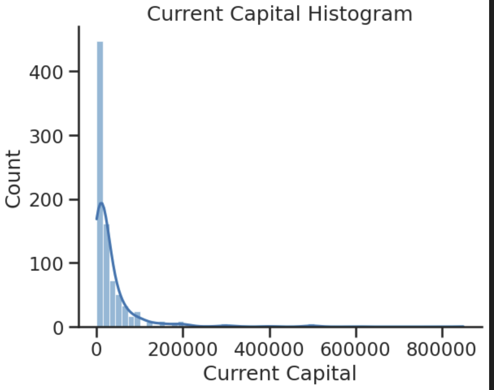
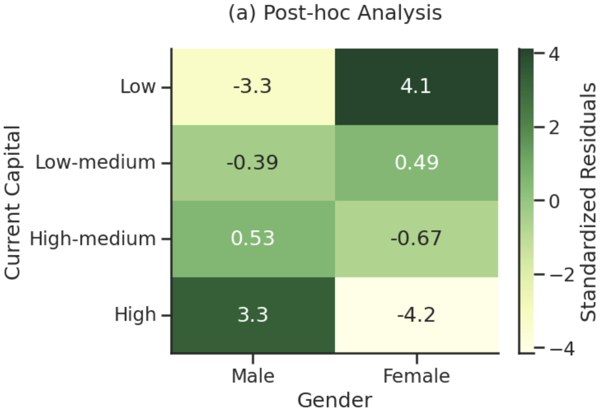
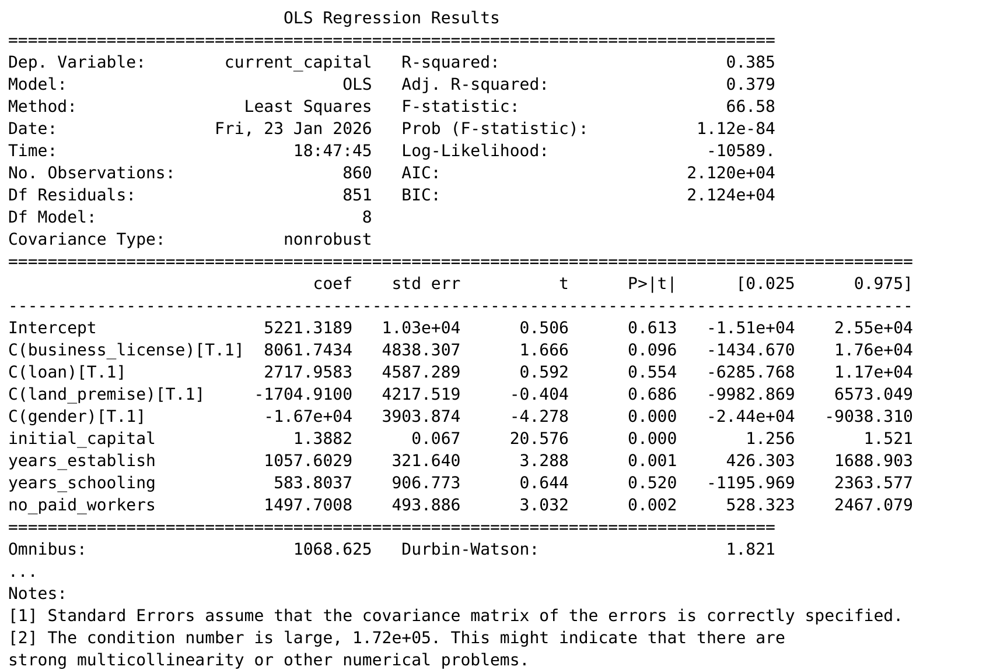
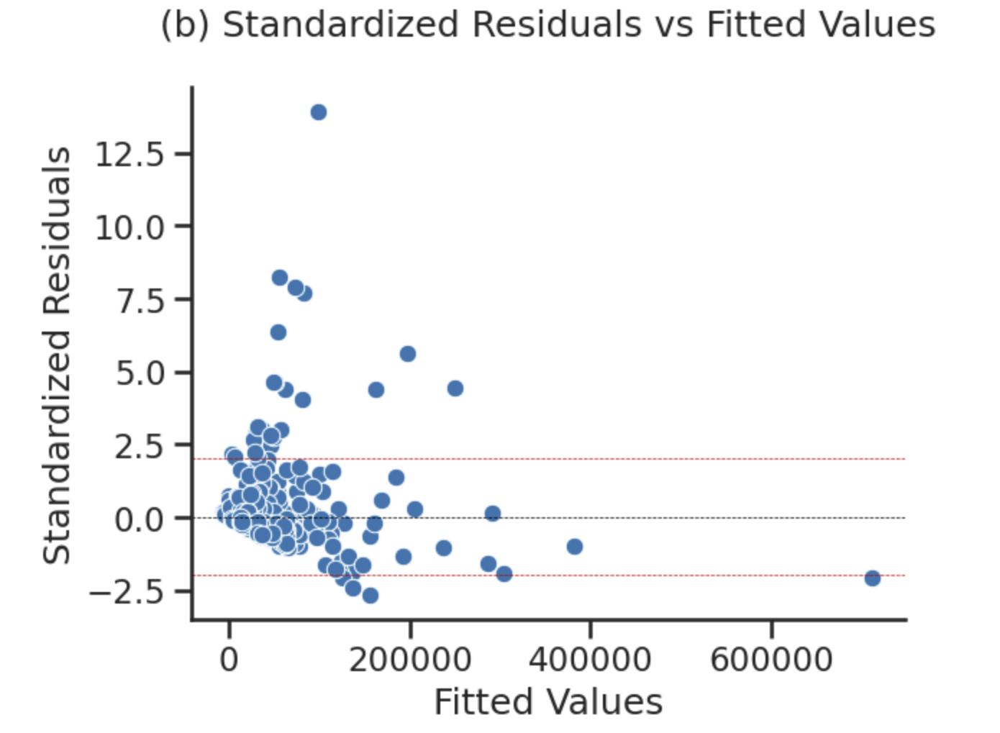
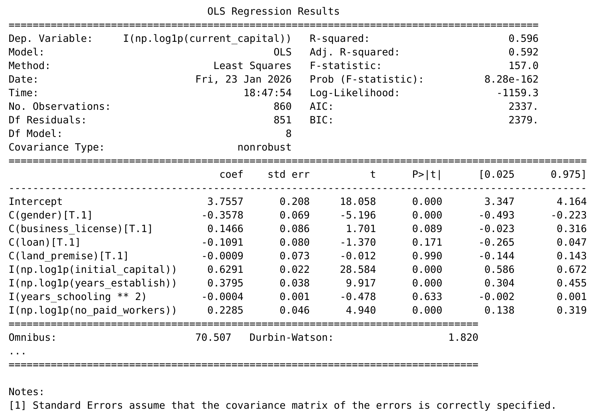
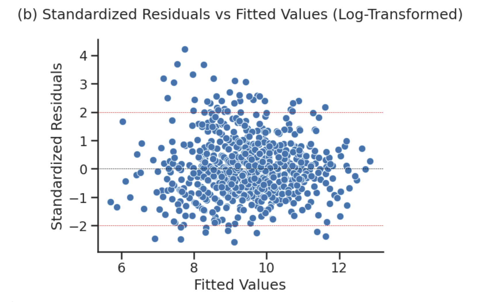
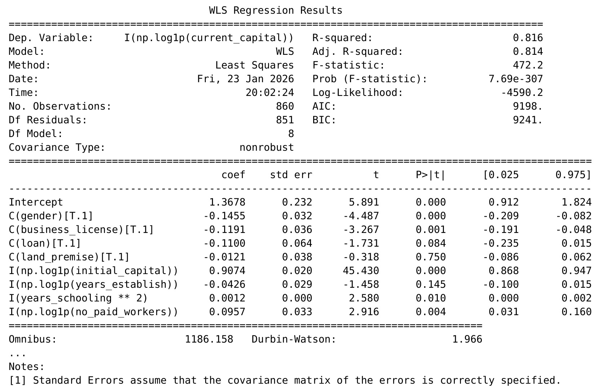
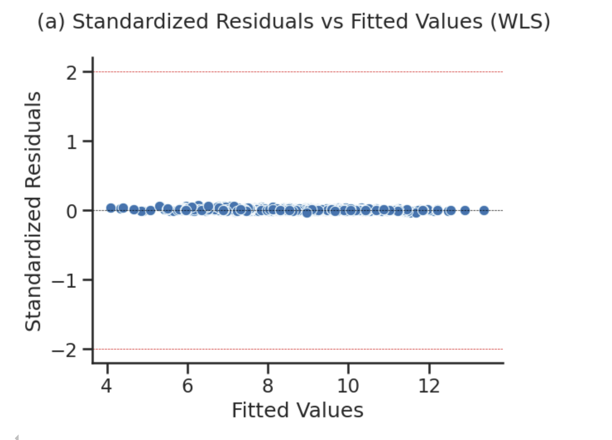

## Introduction

Micro and Small Enterprises (MSEs) are the backbone of Ethiopia's industrial sector. As highlighted by Gebreeyesus (2011), they are considered the heart of development. However, many MSEs face significant hurdles in scaling their operations. Understanding what specific factors contribute to their growth—measured in this study by their current capital—is essential for crafting effective supporting policies.

This project leverages a robust dataset of 860 MSEs to explore how variables such as initial capital, owner's education, gender, and institutional factors influence financial outcomes. My goal was not just to build a predictive model, but to navigate the complexities of real-world data, ensuring that the final results are statistically valid and address the common violations of regression assumptions.

## Methodology & Tools

I chose a Multiple Linear Regression (MLR) approach to isolate the effect of each predictor while holding others constant. The analysis was entirely implemented in **python**, using `statsmodels` for rigorous testing.

```python
import pandas as pd
import numpy as np
import statsmodels.api as sm
import statsmodels.formula.api as smf
import seaborn as sns
import matplotlib.pyplot as plt
```

The heart of this analysis lies in its iterative nature. I moved through three distinct models, each built to solve a problem identified in the previous step.

---

## Step 1: Exploratory Data Analysis & Social Disparities

The first step in any analytical journey is exploring the data to understand its shape and the relationships within. I used `seaborn` and `matplotlib` to visualize how current capital interacts with various categorical and continuous predictors.

### Visualizing the Skewness
One of the most striking observations from the start was the extreme skewness of `current_capital`. Most MSEs have relatively low capital, while a few "outliers" possess significantly more. This heavy right-skew is a major flag for linear regression, as it often leads to non-normal residuals.
```python
# Visualizing the skewness of current_capital
sns.histplot(
    data = data,
    x = "current_capital",
    kde = True
)
plt.title("Current Capital Histogram")
plt.xlabel("Current Capital")
sns.despine()
plt.show()
```



### Predictor Comparisons: Gender and Education

I performed post-hoc analysis to see if specific demographics were "over-represented" in high or low capital brackets after using chi-square testing to verify there is significant association between gender and current capital.

*   **The Gender Gap**: The analysis revealed a clear achievement gap. Males were found in high-capital categories more often than expected by chance, while females were significantly concentrated in the lowest capital category.

```python
tab1 = pd.crosstab(cat_compare["current_capital_categorical"], data["gender"])
chi2, p, dof, expected1 = chi2_contingency(tab1)

residuals = (tab1 - expected1)/ np.sqrt(expected1)
residuals.columns = ["Male", "Female"]

sns.heatmap(residuals, annot=True, center=0, cmap = "YlGn", cbar_kws={"label" : "Standardized Residuals"})
plt.title("(a) Post-hoc Analysis\n")
plt.xlabel("Gender")
plt.ylabel("Current Capital")
sns.despine()
plt.show()
```

---

## Model 1: Initial OLS as a Diagnostic Tool

I began with a standard Ordinary Least Squares (OLS) model. At this stage, the model was primarily used to check if the basic assumptions of linear regression held true.

```python
# Model 1: Initial OLS using raw data
model_ols = smf.ols('current_capital ~ initial_capital + years_establish + years_schooling + no_paid_workers + C(gender) + C(loan) + C(business_license)', data=data).fit()
print(model_ols.summary())
```


### Why Model 1 Failed
The model achieved an R-squared of 38.5%, but the diagnostics revealed a major roadblock: **Heteroscedasticity**.
- The **Breusch-Pagan test** gave a p-value of 0.0005, providing strong evidence that the error variance was not constant.
- Diagnostic plots (Residuals vs Fitted) showed a clear "fan" shape, a classic indicator of heteroscedasticity.
- The Q-Q plot also showed non-normality, largely due to the extreme skewness of the capital variables identified in Step 1.

```python
# plotting residuals vs fitted values
standard_resid = model.resid / np.sqrt(model.mse_resid)

sns.scatterplot(x = model.fittedvalues, y = standard_resid)
plt.title("(b) Standardized Residuals vs Fitted Values\n")
plt.ylabel("Standardized Residuals")
plt.xlabel("Fitted Values")
sns.despine()
plt.axhline(0, color = "black", linestyle = "--", linewidth = 0.5)
plt.axhline(2, color = "red", linestyle = "--", linewidth = 0.5)
plt.axhline(-2, color = "red", linestyle = "--", linewidth = 0.5)

plt.show()
```

---

## Model 2: Addressing Skewness with Log Transformations

Following the initial findings, it was clear that the raw data was too skewed. Economic variables often follow a power-law distribution, making log transformations a standard fix. I applied the `log(1+x)` transformation to both the dependent and several independent variables to pull in extreme values and stabilize the distribution.

```python
# Model 2: Log-Transformed Model (Log-Log)
# We log-transform capital and employment metrics while squaring education
# to account for potential non-linear effects uncovered in EDA.
data["current_capital_log"] = np.log1p(data["current_capital"])
data["initial_capital_log"] = np.log1p(data["initial_capital"])
data["no_paid_workers_log"] = np.log1p(data["no_paid_workers"])
data["years_schooling_sq"] = data["years_schooling"] ** 2

# fitting log model
model_log = smf.ols(
    formula = "I(np.log1p(current_capital)) ~ I(np.log1p(initial_capital)) + I(np.log1p(years_establish)) + I(years_schooling ** 2) + I(np.log1p(no_paid_workers)) +  C(gender) + C(business_license) + C(loan) +C(land_premise)", 
    data = data,
).fit()

print(model_log.summary())
```


### Improvements & Remaining Challenges
This "Log-Log" model saw a significant jump in performance:
- **Adjusted R-squared**: Increased to 59.2%.
- **Normality**: Q-Q plots showed a much more linear trend, indicating better normality.
- **Persistent Heteroscedasticity**: Despite the log transformations, the Breusch-Pagan test still gave a p-value of 0.0000. While the model was better, it wasn't yet robust enough for inference.

The new residual vs. fitted vlaues plot can be seen below.

---

## Model 3: Solving Heteroscedasticity with Weighted Least Squares (WLS)

To finally resolve the issue of non-constant variance, I implemented **Weighted Least Squares (WLS)**. This technique assigns weights based on the variance of the residuals, essentially giving more weight to the observations we are most "certain" about.

I estimated the weights by regressing the squared residuals from the second model on the predictors and taking the reciprocal of the resulting fitted values.

```python
# Model 3: Final WLS Model
# We first model the error variance by regressing squared residuals on predictors
# Then, use 1/fited_values as weights to penalize high-variance observations.
ols_model = smf.ols(
    formula = "I(np.log1p(current_capital)) ~ I(np.log1p(initial_capital)) + I(np.log1p(years_establish)) + I(years_schooling ** 2) + I(np.log1p(no_paid_workers)) +  C(gender) + C(business_license) + C(loan) +C(land_premise) + C(subsector) + C(subsector)", 
    data = data,
).fit()

sq_resid = (ols_model.resid) ** 2
variance_data = data.copy()
variance_data["sq_resid"] = sq_resid

predictor_vars = "I(np.log1p(initial_capital)) + I(np.log1p(years_establish)) + I(years_schooling ** 2) + I(np.log1p(no_paid_workers)) +  C(gender) + C(business_license) + C(loan) +C(land_premise) + C(subsector) + C(subsector)"

sq_resid_model = smf.ols(
    formula = f"sq_resid ~ {predictor_vars}",
    data = variance_data
).fit()

weights = 1 / (np.maximum(sq_resid_model.fittedvalues, 1e-6))

# fitting wls model
model_wls = smf.wls(
    formula = "I(np.log1p(current_capital)) ~ I(np.log1p(initial_capital)) + I(np.log1p(years_establish)) + I(years_schooling ** 2) + I(np.log1p(no_paid_workers)) +  C(gender) + C(business_license) + C(loan) +C(land_premise)",
    data = data,
    weights = weights
).fit()

print(model_wls.summary())
```


### The Best Fit
The WLS model was a resounding success:
- **Explanatory Power**: The R-squared jumped to **81.6%**.
- **Efficiency**: Standard errors were now more reliable.
- **Robustness**: Diagnostic plots finally showed a more uniform distribution of errors, with homoscedasticity assumption fulfilled, and the Durbin-Watson statistic (1.966) indicated no autocorrelation.

The residual vs. fitted values plot can be seen below.


---

## Key Findings & Policy Implications

The finalized WLS model provides the most accurate window into how MSEs in Ethiopia operate:

1. **The Magnitude of Initial Funding**: Initial capital is the single strongest predictor. Every 1% increase in initial capital leads to a **0.91% increase** in current capital.
2. **Systemic Gender Gap**: Female-owned MSEs have approximately **14.6% lower current capital** than male-owned ones, even when controlling for other factors like initial funding and education.
3. **Vocational Entry vs. Schooling**: Interestingly, owners with a primary level of education as their highest level appeared to have higher current capital than high-school graduates, suggesting the value of early market entry and practical experience in several sub-sectors.
4. **Institutional Costs**: Having a business license and loan access were negatively associated with current capital—this might reflect the debt burden of high-interest loans and the administrative costs/taxes associated with formalization for these small-scale firms.

## Conclusion

Building a robust econometric model requires a critical look at diagnostics. By moving from a failing OLS baseline to a refined WLS model, the explanatory power was more than doubled (from 38.5% to 81.6%). This rigorous approach ensures that our findings about initial wealth and gender disparities are statistically sound and can provide a better foundation for policy-making.

*For the complete analysis and code implementation, please refer to the GitHub repository and full report linked at the top of this article.*

---

## Acknowledgments
I would like to express my gratitude to our instructor **Zelalem T.** for his guidance throughout this project. I also want to thank my co-authors and groupmates: **Yoseph H. Tilahun**, **Yonas D. Melese**, **Abenezer Y. Bekele**, **Fitsum A. Zewude**, and **Rahel D. Shikur** for their collaboration and hard work.
